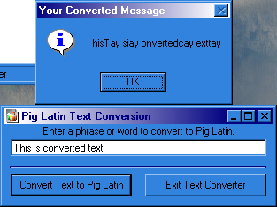



## A Pig Latin Text Converter

### Description

This code does nothing more than take a word or phrase and convert it to Pig Latin. Now, it is not finished, as I need to somehow figure out how to take in account punctuation. It is almost there, tho, and any suggestions would be nice.
 
### More Info
 

             |
---                |---
**Submitted On**   |2000-02-29 09:35:28
**By**             |[VBScript](https://github.com/Planet-Source-Code/PSCIndex/blob/master/ByAuthor/vbscript.md)
**Level**          |Beginner
**User Rating**    |5.0 (10 globes from 2 users)
**Compatibility**  |VB 5\.0, VB 6\.0
**Category**       |[String Manipulation](https://github.com/Planet-Source-Code/PSCIndex/blob/master/ByCategory/string-manipulation__1-5.md)
**World**          |[Visual Basic](https://github.com/Planet-Source-Code/PSCIndex/blob/master/ByWorld/visual-basic.md)
**Archive File**   |[CODE\_UPLOAD36902292000\.zip](https://github.com/Planet-Source-Code/vbscript-a-pig-latin-text-converter__1-6323/archive/master.zip)

